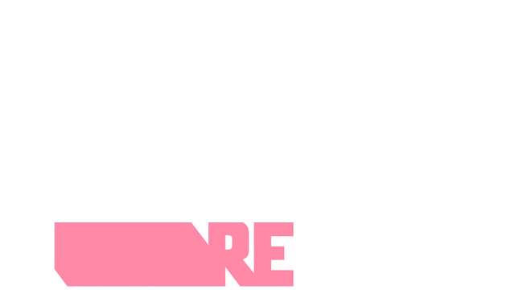
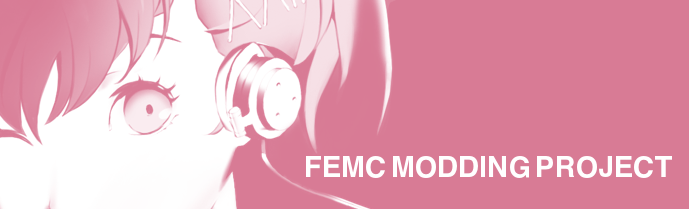

# Persona 3 Reload Mod Project: Femc Reloaded Project

ドキュメントの言語: [EN](README.md) | [RU](README.ru.md) | [JA](README.ja.md)

_ⓒATLAS ⓒSEGA All Rights reserved.この MOD は SEGA や ATLAS とは一切関係ありません。何らかの形で貢献を行う前に、README の全文をお読みください。_
## _"Femc True"_

## はじめに
<foo style="color:pink;">「P3R」に琴音を登場させることがこの MOD の概要です。PC 版向けに制作されており、**まずは英語版**として公開していますが、多言語への対応も歓迎しています！</foo>

## プロジェクトのリンク
- [Discord](https://discord.gg/femc)
- [Persona MOD 適用のチュートリアル](https://gamebanana.com/tuts/17156)
- [構成アプリ](https://github.com/MadMax1960/Femc-Config-Adjuster/releases)
- [Wiki](https://github.com/MadMax1960/Femc-Reloaded-Project/wiki)
- [Raw ファイルリポジトリ](https://github.com/MadMax1960/Femc-Reloaded-Raw-Files)
- [KingDDD の YouTube チャンネルでは、すべてのアップデートや追加機能を紹介する動画を公開しています！](https://www.youtube.com/@kingddd)

## 貢献のやり方
どのような貢献も大歓迎です！貢献内容を Pull request として送信する方法については [Wiki](https://github.com/MadMax1960/Femc-Reloaded-Project/wiki) をご確認ください。あるいは、[Discord](https://discord.gg/femc) に参加して質問することも可能です！

## 開発メンバー
**ディレクター**: A Mudkip (MadMax1960)

**主要な 2D の貢献者**: catboyronaldreagan (Adrien)、esablythe、yuhaino、Mekki

**3D アニメーションリード**: cpido

**主要な 3D の貢献者**: dniwetamp、esablythe、raycooper

**オーディオリード**: giowno、kindredtea、mosq

**主要なコードの貢献**: rirurin、teolicht (Iván)

**イベント編集リード**: raycooper、rirurin 

**主要なテキストの貢献**: kiawaii (Kiara)、ciel_bell、Smerz

**主要な声優**: realmelodyhope (Femc)

**日本語のローカライズリード**: misegalf

**中国語 (簡体字) のローカライズリード**: gingerbread_ginger

**スペイン語のローカライズリード**: kiawaii (Kiara)

 

## 著作権について

本プロジェクトは、このページをクレジット (出典を明記) し改変・流用したアセットを販売せず、かつ同様のライセンスの下で公開することを条件にアセットを自由に流用・編集可能なライセンスを採用しています。ただし、収益化に関して一つ例外があります。オリジナルのアセットを提供するアーティストである場合、そのライセンスでは「自身が制作したオリジナルのアート作品」を販売することが認められます。

## 重要: 著作権とライセンス

このプロジェクトは「Persona」シリーズへのオマージュとして制作されたファンメイド MOD (改変) です。 
いくつかの留意点は以下の通りになります:

- **金銭的目的ではありません**: この MOD を販売目的にすることは一切ありません。これは、オリジナル作品である「Persona 3」と開発者への愛情から、有志のファンが同じファンのために制作しているものです。金銭的利益を得ることを目的としていません。

- **ライセンス**: 本プロジェクトおよびすべてのコンテンツは、[クリエイティブコモンズ 表示-非営利- 継承 4.0 国際ライセンス (BY-NC-SA 4.0)](https://creativecommons.org/licenses/by-nc-sa/4.0/deed.ja) の下でライセンスされています:

- **表示 (BY)**: 適切なクレジットを表示とライセンスへのリンクを記載し、変更を加えた場合はその旨を明示しなければなりません。これらは合理的な方法で行えますが、ライセンス提供者やあなたの利用方法を支持・推奨していると誤解される形で表示してはなりません。

- **非営利 (NC)**: 本プロジェクトのコンテンツを営利目的で利用することはできません。

- **継承 (SA)**: 本プロジェクトを改変・派生作品として利用した場合は、元となる作品と同じライセンス (CC BY-NC-SA 4.0) の下で公開する必要があります。

- **元の著作権者への敬意**: ATLAS の「Persona」シリーズに関連するロゴや商標などのキャラクターに関するあらゆる権利は、SEGA、ATLAS またはその他の正当な権利者に帰属します。本プロジェクトによって、それらの権利が移転・変更されることはありません。

この MOD は、Persona シリーズへの愛情から生まれたプロジェクトです。 
私たちは、原作者の権利を侵害することを目的としているのではなく、Persona シリーズへの敬意を表し、ファンコミュニティ全体の創造性を共有・発展させることを目的として制作しています。
