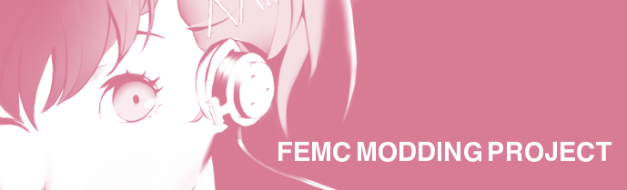

# Persona 3 Reload Mod Project: Femc Reloaded Project

Язык документа: [EN](README.md) | [RU](README.ru.md)

_ⓒAtlus ⓒSega Все права защищены, этот мод не связан с Sega или Atlus, все права защищены, прочитайте полное Readme перед любым вкладом_

## _"Femc True"_

## Введение
<foo style="color:pink;">Мы вводим Котоне в P3R, вот и все. Этот мод создан для PC-версии и доступен сначала на английском, но все языки приветствуются!</foo>

## Ссылки на проекты
- **Discord (Доступен только на английском.)**: [Вступить в наше сообщество](https://discord.gg/yxtDmX7qXd)
- **Persona Modding Tutorial (Доступен только на английском.)**: [Начнать заниматься моддингом](https://gamebanana.com/tuts/17156)
- **Репо Raw файлов**: [Здесь хранятся необработанные файлы](https://github.com/MadMax1960/Femc-Reloaded-Raw-Files)

## Как внести свой вклад в проект?
Практически любой вклад приветствуется! Вы можете заглянуть в вики, чтобы узнать, как отправить свой собственный запрос или присоединяйтесь к Discord Server (Основной язык анлийский.) и спрашивайте там!

## Руководители проекта
- **Lead/Director**: A Mudkip (@MadMax1960), orchestrating it all, 3D Lead.
- **Audio Lead**: Kindred
- **2D Lead**: Esa Blythe/CatBoyRonaldReagan
- **Event Lead**: Ciel-Bell
- **Major Code Contributor**: Rirurin
- **Major 3d Contributor**: Ray Cooper
- **Task Manager**: Fernando Holguin (@Fernhw), Tasks management. 

## Локализация мода
- **Разбор ресурсов/Компиляция/Тестирование**: Glopente, Max-gg.
- За основу взят официальный русификатор игры от Atlus/SEGA

 

## Авторские права TLDR; 

Этот проект находится под лицензией, которая позволяет вам свободно брать и редактировать активы по своему усмотрению, при условии, что вы указываете эту страницу, не продаете свои отредактированные/взятые активы и публикуете их под этой же лицензией. Есть исключение, когда дело доходит до монетизации, если вы художник, предоставляющий арт, лицензия позволяет продавать *ваш* арт, но вы должны быть согласны с тем, чтобы другие люди могли редактировать ваш арт для использования в других модах или в этом. Никто не может продавать ваши работы, но вы можете продавать их сами.

## ВАЖНО: Авторское право и лицензия

Этот проект представляет собой фанатский мод (модификацию), созданную как дань уважения серии Persona. Следует отметить следующие моменты:

-**Не для продажи**: Этот мод не продается и никогда не будет продаваться. Это просто фанаты, делающие что-то для своих фанатов из чистой любви к оригинальной игре Persona 3 и ее разработчикам. Никакой денежной выгоды от этого не преследуется.

-**Лицензия**: Этот проект и все его содержимое лицензированы на условиях Creative Commons Attribution-NonCommercial-ShareAlike 4.0 International License (BY-NC-SA 4.0). Это означает:

- **Атрибуты (BY)**: Вы должны указать соответствующие авторство, дать ссылку на лицензию и указать, были ли внесены изменения. Вы можете сделать это любым разумным способом, но не таким, который предполагает, что лицензиат одобряет вас или ваше использование.

- **Не комерческое (NC)**: Вы не можете использовать этот материал в коммерческих целях.

- **Сохранение условий (SA)**: Если вы делаете ремикс, преобразовываете или создаете материал, вы должны распространять свои материалы по той же лицензии, что и оригиналы.

-**Уважение к владельцам оригинальных авторских прав**: Любые права на персонажей, такие как логотипы или торговые марки, связанные с франшизой Atlus, известной как Persona, остаются их собственностью или собственностью других соответствующих правообладателей, будь то Sega или сама Atlus.

Этот мод - труд любви, созданный в честь серии Persona и для того, чтобы поделиться нашим коллективным творчеством в фанатском сообществе, не нарушая прав создателей оригинала.
